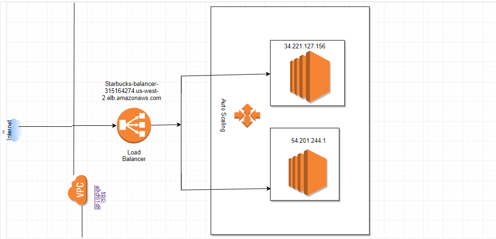
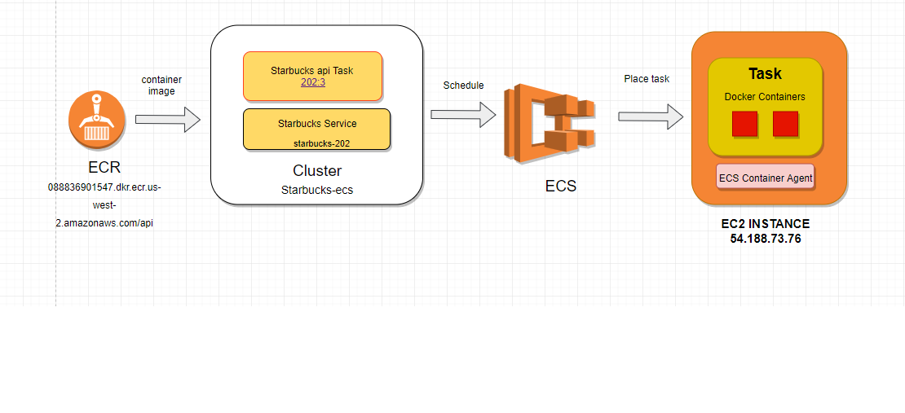

# CMPE 202 Starbucks API

### Table of Contents

1. [Introduction](#introduction)
2. [Features](#features)
    - [Users & Authentication](#features)
    - [Cards](#features)
    - [Orders](#features)
    - [Payment](#features)
3. [Architecture](#architecture)
4. [Documentation](#documentation)
5. [Developer Logs](#logs)
    - [Project Journals](#logs)
    - [SCRUM Board](#logs)
    - [Burndown Chart](#logs)

## Introduction

<strong>Team Members</strong>

[@mimlowe](https://github.com/mimlowe) - Michael Lowe, User Profiles & Authentication

[@iivaishnavii](https://github.com/iivaishnavii) - Vaishnavi Ramesh, Add Cards

[@KavyaChennoju97](https://github.com/KavyaChennoju97) - Kavya Chennoju, Manage Orders

[@psnehas](https://github.com/psnehas) - Sneha Sneha, Make Payments

## Features

#### Users & Authentication

`.post(/user)` Creates a new user

`.get(/user/:email)` Finds an existing user profile by email

`.delete(/user)` Deletes an existing user profile

`.post(/user/authenticate)` Sets authenticated flag `true` on user profile if email and pin match

`.post(/user/logout)` Sets authenticated flag `false` in user profile

#### Cards

`.post(/addCard)` Allows for card creation and adding cards to user profiles

#### Orders

`.post(/orders)` Allows for the creation of orders

`.get(/orders)` Displays a list of user's active orders

#### Payments

`.post(/makePayment)` Contains logic for making payments. Completes user's orders, checks and adjusts card balance.

## Documentation

Full documentation is available through
[Postman Documenter](https://documenter.getpostman.com/view/6559172/S1Lx1U85)

## Architecture

### EC2 Deployment Diagram

### ECS Deployment Diagram

## Logs

### Project Journal

<strong>1. Communication:</strong>

  All of us worked jointly in developing the APIs. All decisions were made unanimously - right from creating schema for the project to deploying the project.  This resulted in rapid feature development and deployment.

  We had status calls for 10 minutes, the entire week, to sync up on our status.

  We used Github scrum boards to create issues and this helped us in tracking open issues and helped us to complete the project successfully.

<strong>2. Simplicity:</strong>

  The code implemented is simple, easy to understand and well-documented. In the future, if we plan to modify certain functionalities, the task would be simple, as the components are modular and well documented.

<strong>3. Feedback:</strong>

  During the one week of development, each team member developed their API and got feedback from other members of the team. Everyone not only tested their API but also tested the APIs of other team members and tested all corner cases. The outcome of this effort was the creation of a set of robust APIs.

<strong>4. Respect:</strong>

  Each team member completed the task assigned to them , on time and contributed towards the common goal.

<strong>5. Courage:</strong>

  During the feedback phase, each team member was open to criticism and handled the feedback in a positive manner.

One activity of deploying services to AWS in an Auto Scaled EC2 Cluster with Load Balancer and deploying to AWS as Docker Containers in Amazon Containers is a perfect example of our team following the XP values. No one had prior experience in deploying services to scalable servers/dockers. Hence , we decided to tackle the problem together. We read articles and figured out a way to deploy the services successfully.This activity marks all the checkboxes of XP core values - communication, feedback, respect, courage and simplicity.

### SCRUM Board  
Available through [GitHub Projects](https://github.com/gopinathsjsu/teamproject-sharks/projects/1)

### Burndown Chart
Available through [Google Sheets](https://docs.google.com/spreadsheets/d/1DYcUOFwiUoBoNflIyikQGykGCQYsfOQZoiGb_CPGHwA/edit?usp=sharing)
